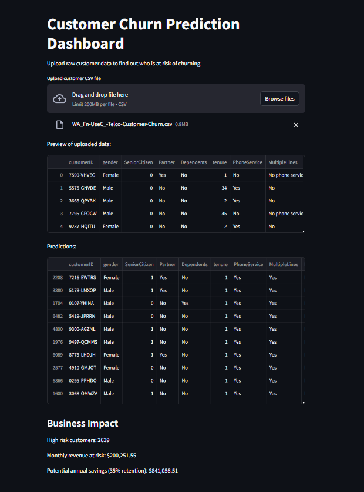
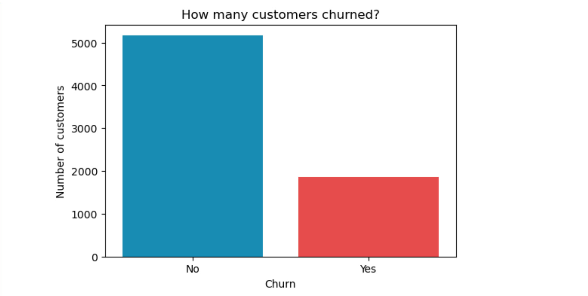
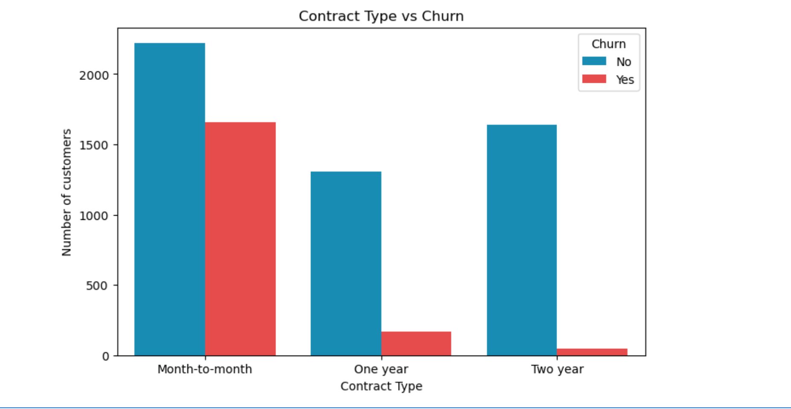
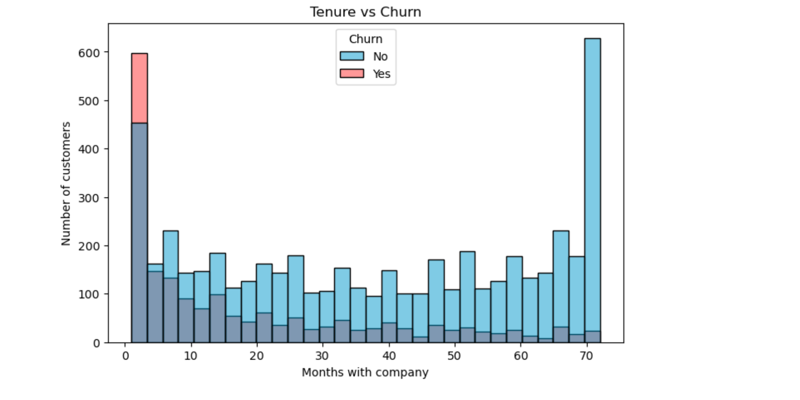
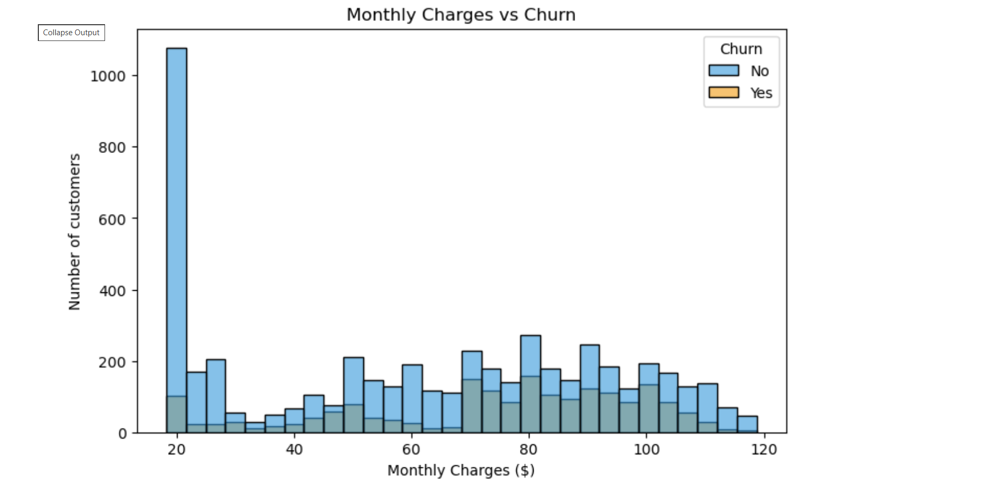
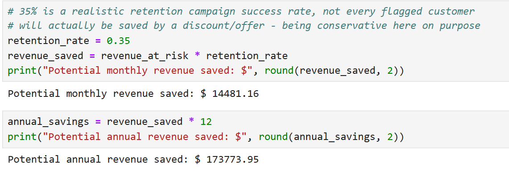

# 📊 Customer Churn Prediction

A machine learning project to predict which telecom customers are likely to leave, and estimate the revenue impact of acting on those predictions early.

---

## 📖 Overview

Customer churn is one of the biggest challenges for subscription-based businesses. This project covers the complete data science workflow — from raw data to a live prediction dashboard — using the IBM Telco Customer Churn dataset.

---

## 🎯 What I built

- Cleaned messy real-world data (found hidden missing values stored as blank spaces)

- 6 EDA charts identifying key churn drivers

- Created 2 new features: AvgMonthlySpend and NumServices

- Compared 3 models: Decision Tree (73%) → Random Forest (78%) → XGBoost (79%)

- Tuned decision threshold from 0.5 → 0.3, improving recall from 50% → 75%

- Live Streamlit dashboard — upload raw customer CSV, get churn risk scores instantly

---

## 🔍 Key Findings

- 26.5% of customers are churning — roughly 1 in 4

- Month-to-month contract customers churn far more than 1 or 2 year contracts

- Churn is heavily concentrated in the first few months of joining

- Fiber optic customers churn the most despite being on the premium plan

- Customers with more add-on services churn significantly less (44% → 5%)

- Senior citizens churn at 42% vs 24% for non-seniors

---

## 💼 Business Impact

| Metric | Value |
|---|---|
| High risk customers flagged | 549 |
| Monthly revenue at risk | $41,374 |
| Potential annual savings (35% retention) | ~$173,773 |

---

## 📈 Model Results

| Model | Accuracy |
|---|---|
| Decision Tree | 73% |
| Random Forest | 78% |
| XGBoost (tuned) | 79% |

Final model recall for churners: **75%** (after threshold tuning)

---

## 📸 Screenshots

### Streamlit Dashboard



### Churn Distribution



### Contract Type vs Churn



### Tenure vs Churn



### Monthly Charges vs Churn



### Business Impact



---

## 🛠️ Tech Stack

Python, Pandas, NumPy, Matplotlib, Seaborn, Scikit-learn, XGBoost, Streamlit, Joblib

---

## 📂 Project Structure

```text
churn-project/

├── data/
│   └── WA_Fn-UseC_-Telco-Customer-Churn.csv

├── notebooks/
│   └── customer_churn_prediction.ipynb

├── models/
│   ├── churn_model.pkl
│   └── model_columns.pkl

├── images/
│   ├── dashboard.png
│   ├── churn_distribution.png
│   ├── contract_churn.png
│   ├── tenure_churn.png
│   ├── monthly_charges_churn.png
│   └── business_impact.png

├── app.py

├── requirements.txt

└── README.md
```

---

## ⚙️ How to run

```bash
pip install -r requirements.txt

streamlit run app.py
```

---

## 👨‍💻 Author

**Abhishek Kumar**

GitHub: [github.com/abhishek-kumar1517](https://github.com/abhishek-kumar1517)

LinkedIn: [linkedin.com/in/abhishek-kumar-55290433b](https://linkedin.com/in/abhishek-kumar-55290433b)
